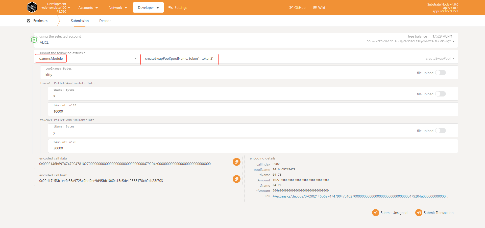
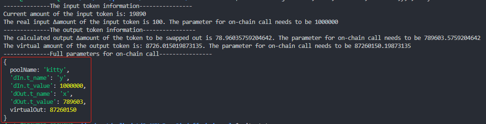
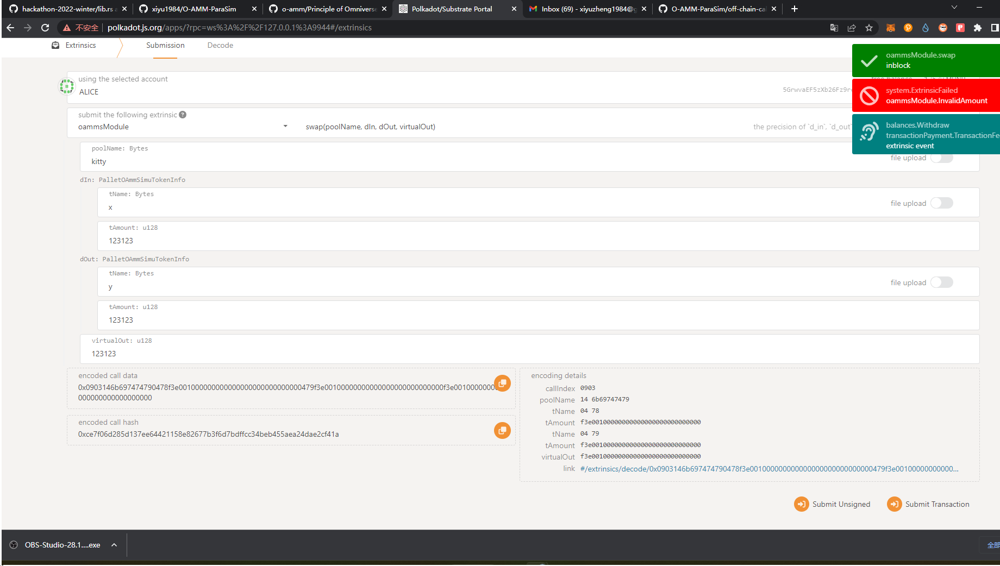

# Tutorial

## Operation
### Create Simu-Token Pool
* Create a token pool by calling the on-chain interface `createSwapPool` in `oammsModule`:  
  

### Check Token Pools
* You can check the details of the token pools with `Polkadot.js/app` as follows:  
    <p id="figure.1" align="center">Figure.1 Check the details on-chain</p>  

      

    * `oammsModule` is the pallet name.
    * Choose the interface `tokenPool` and click `＋`.
    * You can see the details of created swap pools.

### Swap
#### On-chain Interface
* Go to `Developers` -> `Extrinsics`, Choose `oammsModule` and interface `swap`:  
    <p id="figure.2" align="center">Figure.2 On-Chain Swap Call</p>  

      

    * `dIn` and `dOut` is the token to be swapped in and out, and note that the `t_amount` has the precision `0.0001`, for example, if we input `12345678`, the real value is `1234.5678`.
    * `virtualOut` is the virtual amount of the current output token, it has a precision `0.0001`.  

* Everythin will be calculated off-chain first. 

#### Off-Chain Calculation Tools
* Locate your terminal just in this repo.
* Installation
    ```sh
    npm install
    ```
* Check the operations.
    ```sh
    node index.mjs --help
    ```
    
    * Operation `swap` is used to calculate the details of a swap, the result of which is just the input parameters of the interface `swap` on-chain.
    * Operation `price` is used to calculate the price of related tokens, that is to calculate $\frac{dy}{dx}$.  

* Make a swap calculation.
    * Get the values of `b`, `C` and `the amount of the input token` from on-chain, which is detailed in [Figure.1](#figure.1).
    * An example of a off-chain swap calculation script is as follows:  
    ```sh
    # -s <Δamount>,<amount>,<b>,<C>,<input token name><output token name><pool name>
    # @Δamount is the input amount of token x
    # @amount is the amount of token x got from on-chain(Figure.1)
    # @b is got from on-chain(Figure.1)
    # @C is got from on-chain(Figure.1)
    # @input token name
    # @output token name
    # @pool name
    node index.mjs -s 100,10000,282842712,200000000,x,y,kitty
    ```
    * You will get an output as below, and these are just the values for the on-chain swap interface:  
    <p id="figure.3" align="center">Figure.3 Result of off-chain calculation</p>  

      

* Make a call to on-chain swap  
    * Copy the results in [Figure.3](#figure.3) to the on-chain swap interface in [Figure.2](#figure.2) on `Polkadot.js/app`
    * Execute the swap call.

* After the call confirmed on-chain, [check the related token pool](#check-token-pools) mentioned above and you will find that the tokens' amount have changed.  

#### On-Chain Verification
* If you input some invalid values to the on-chain swap interface in [Figure.2](#figure.2), you may find the following result:  
      

